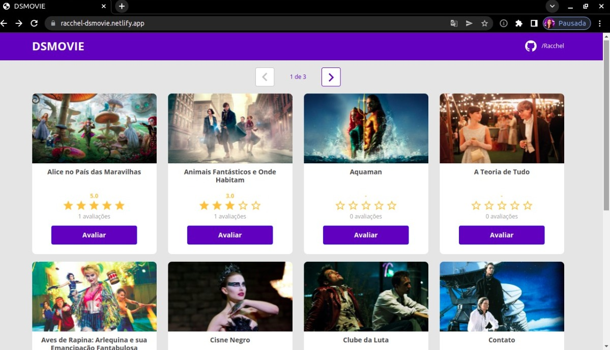
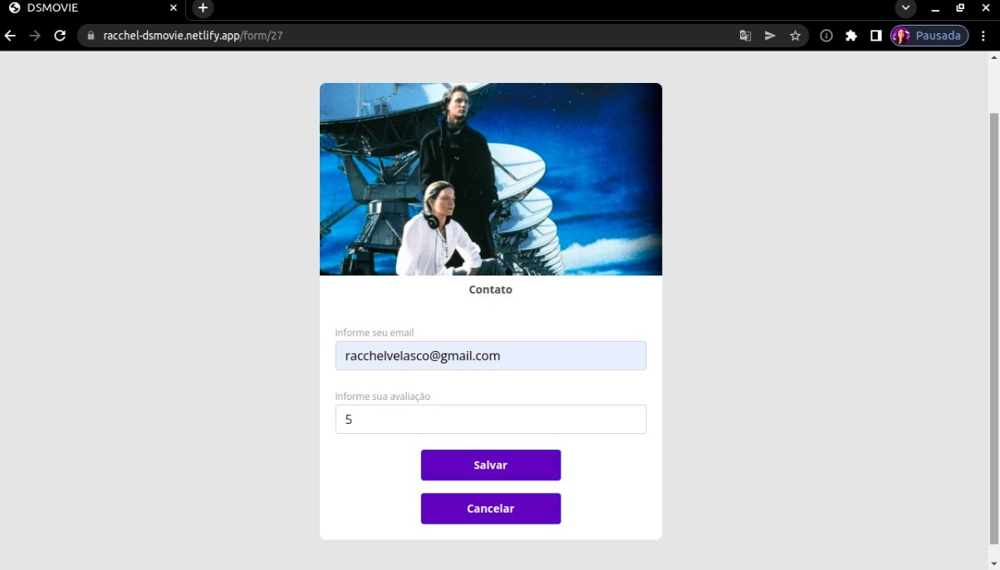

<header>
   
   # 🎬 DS MOVIE
   Projeto realizado na Semana Spring React (DevSuperior)
</header>

- 🔗 **Link**: [racchel-dsmovie.netlify.app](https://racchel-dsmovie.netlify.app)
- ✅ **Status**: Concluído _(e aguardando melhorias)_
- 📝 **Descrição**: Site para avaliação de filmes
- 💜 **Curiosidade**: Meu primeiro projeto fullstack

🚀 **Stacks:**
* __Front-end__: ReactJS (Netlify)
* __Back-end__: Spring (Heroku)
* __Banco__: PostgreSQL

## Front-end

🟣 **Tela inicial:**

 

🟠 **Tela de avaliação:**

🔗 **Link:** [Design no Figma](https://www.figma.com/file/hpQuzpGHq2MmrI87xnfMoT/DSMovie1)

## Backend: 

🔵 **Modelo de domínio:**

🟡 **Padrão de camadas:**

🟢 **Lógica de avaliação dos filmes:**

<footer>

   _Não deixe de entrar no site e avaliar seu filme preferido!_
    

   **By Racchel Velasco - março de 2022**
</footer>