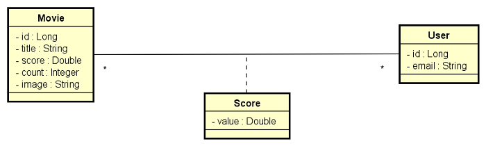
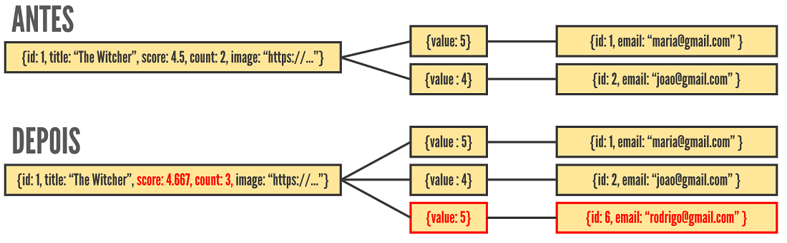

<header style="background-color:rgba(77, 65, 192, 0.7); vertical-align: middle; padding: 10px 10px; color: white; font-weight: bold; text-align: center; border-bottom-left-radius: 40px; border-top-right-radius: 40px; margin-bottom: 50px;">
   <h1 style="color: white">🎬 DS MOVIE</h1>

   
Projeto realizado na Semana Spring React (DevSuperior)

</header>

<section class="info">
   

   - 🔗 **Link**: [racchel-dsmovie.netlify.app](https://racchel-dsmovie.netlify.app)
   - ✅ **Status**: Concluído _(e aguardando melhorias)_
   - 📝 **Descrição**: Site para avaliação de filmes
   - 💜 **Curiosidade**: Meu primeiro projeto fullstack
   

   

   🚀 **Stacks:**
   * __Front-end__: ReactJS (Netlify)
   * __Back-end__: Spring (Heroku)
   * __Banco__: PostgreSQL
   

</section>

<section class="content-title">

   ## Front-end
</section>

🟣 **Tela inicial:**

 

🟠 **Tela de avaliação:**

🔗 **Link:** [Design no Figma](https://www.figma.com/file/hpQuzpGHq2MmrI87xnfMoT/DSMovie1)

<section class="content-title">

## Backend: 
</section>

🔵 **Modelo de domínio:**

🟡 **Padrão de camadas:**

🟢 **Lógica de avaliação dos filmes:**

<footer>

   _Não deixe de entrar no site e avaliar seu filme preferido!_
   By Racchel Velasco - março de 2022
</footer>